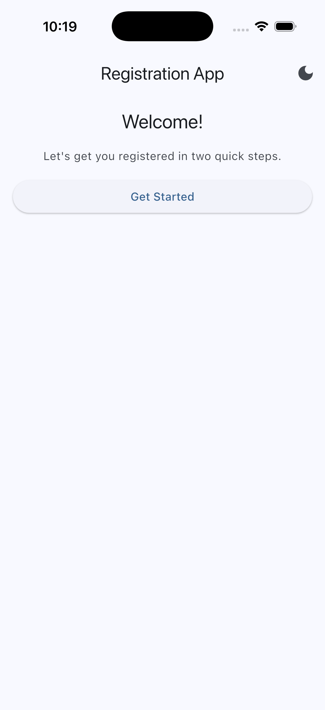
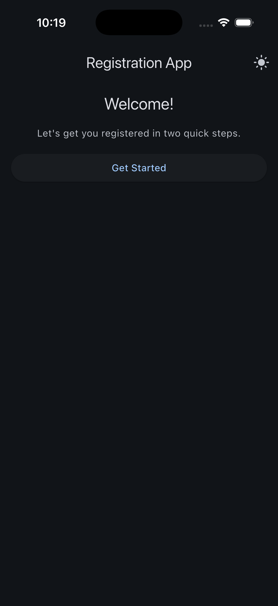
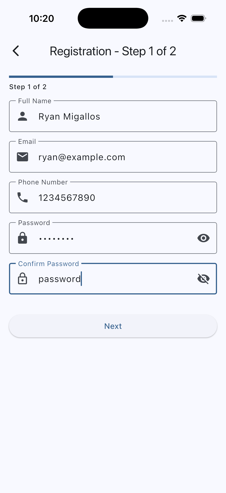
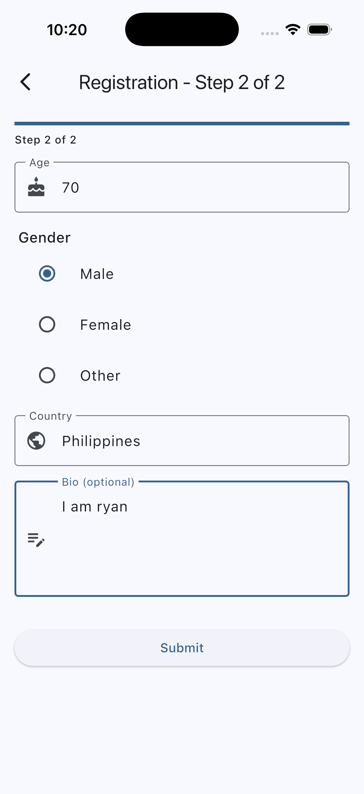
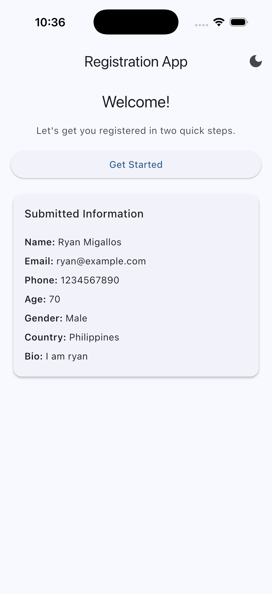

# Multi-Page Registration Form

## Description

A Flutter application demonstrating navigation and form handling across multiple screens. Users can register by filling out a two-page form with validation, and their submitted details are surfaced back on the home screen. Built as the Week 2 capstone — it ties together navigation, forms, validation, and `setState`.

## Features

- Multi-screen navigation
- Form validation on all fields
- Data passing between screens
- Password confirmation
- Age verification
- Gender selection
- Display of submitted registration data

## Screens

1. **Home Screen**: Welcome page with navigation to registration and data display
2. **Registration Page 1**: Personal information form (name, email, phone, password)
3. **Registration Page 2**: Additional information form (age, gender, country, bio)

## Validation Rules

| Field | Rule |
|---|---|
| Name | Required, 3+ characters |
| Email | Required, valid email format |
| Phone | Required, 10+ digits |
| Password | Required, 6+ characters |
| Confirm Password | Must match password |
| Age | Required, 18 or older |
| Country | Required |
| Bio | Optional |

## Screenshots

A walkthrough of the registration flow, in order:

| 1. Get Started | 2. Get Started (Dark) |
|:---:|:---:|
|  |  |
| **3. Registration Page 1** | **4. Registration Page 2** |
|  |  |
| **5. Home — Submitted Data** | |
|  | |

## How to Run

1. Clone the repository
2. Run `flutter pub get`
3. Run `flutter run`

## Project Structure

The `registration_form/lib/` directory is organized into clear layers — entry point, route-level screens, reusable widgets, data models, and pure-logic utilities:

```
lib/
├── main.dart                          # App entry point; sets up MaterialApp + theme toggle
├── models/
│   └── user_data.dart                 # Immutable UserData model passed back from the form
├── screens/
│   ├── home_screen.dart               # Welcome screen; launches registration & renders submitted data
│   ├── registration_page1.dart        # Page 1 form: name, email, phone, password, confirm
│   └── registration_page2.dart        # Page 2 form: age, gender, country, bio + Submit
├── utils/
│   └── validators.dart                # Centralized FormFieldValidator<String> functions
└── widgets/
    ├── gender_selector.dart           # Radio-group gender picker (stateless, parent-controlled)
    ├── info_row.dart                  # Label/value row used inside summary cards
    ├── labeled_text_field.dart        # Outlined TextFormField with icon + password toggle
    └── user_data_card.dart            # Card that displays a submitted UserData record
```

**How the pieces connect:**

- `main.dart` boots `RegistrationFormApp`, owns the `ThemeMode` notifier, and shows `HomeScreen` as the root route.
- `HomeScreen` pushes `RegistrationPage1`; on a successful `Navigator.pop` with data, it stores a `UserData` and renders it via `UserDataCard`.
- `RegistrationPage1` collects personal info and pushes `RegistrationPage2`, passing the Page 1 fields forward.
- `RegistrationPage2` collects the rest, builds a `UserData`, and pops twice to return the record to `HomeScreen`.
- `widgets/` and `utils/` are leaf modules — they have no knowledge of routes or screens, which keeps them reusable and easy to test.

## What I Learned

Week 2 packed in a lot, and this project was where it all clicked:

- **Navigation as a stack** — `Navigator.push` to go forward, `Navigator.pop` with a value to return data. Double-popping from Page 2 to skip straight back to Home felt like a neat trick.
- **Forms** — `GlobalKey<FormState>` + `TextFormField` validators is a surprisingly tidy pattern once you get used to it.
- **Controllers have a lifecycle** — always `dispose()` them. Learned to treat that as muscle memory.
- **`setState` is simpler than I expected** — keep state local, lift it up only when you have to, never put `async` work inside the callback.
- **Null-check navigation results** — users hit back buttons, and the returned data will be `null`. Handle it gracefully.

## Challenges Faced

- Getting password confirmation right meant reaching into `_passwordController.text` from inside the confirm field's validator — a small "aha" moment about how controllers live alongside the form.
- Remembering to pop **twice** (once for Page 2, once for Page 1) to land back at Home with the data in hand.
- Matching `keyboardType` to each field so the phone field shows a number pad, email shows `@`, etc. — tiny detail, big UX win.

Good fun but not easy overall! 🚀
